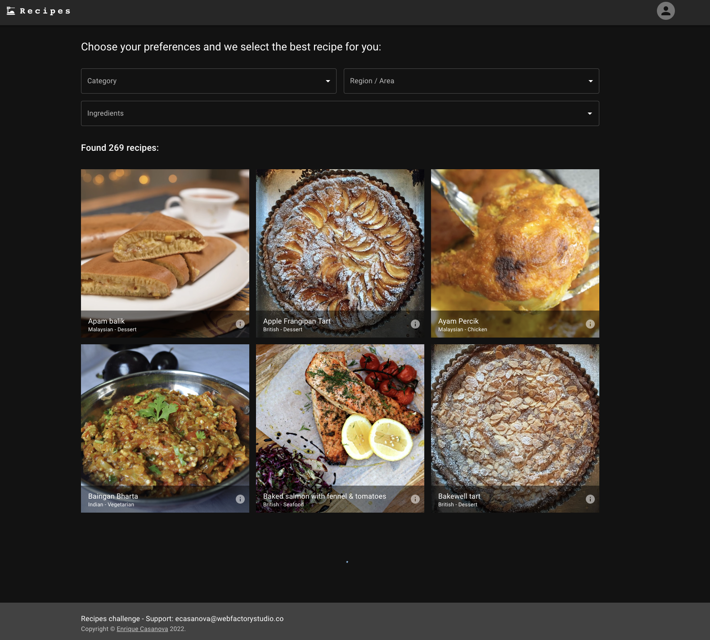
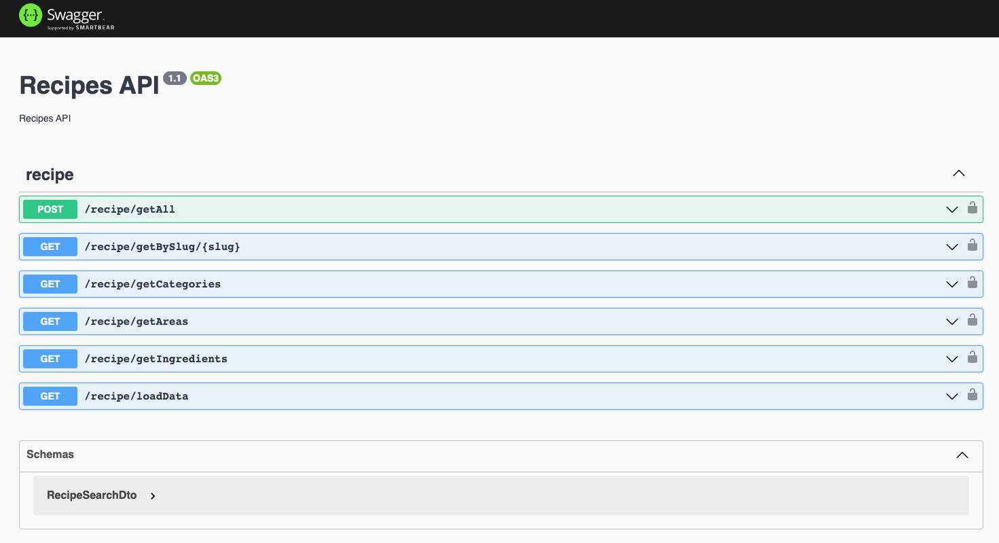
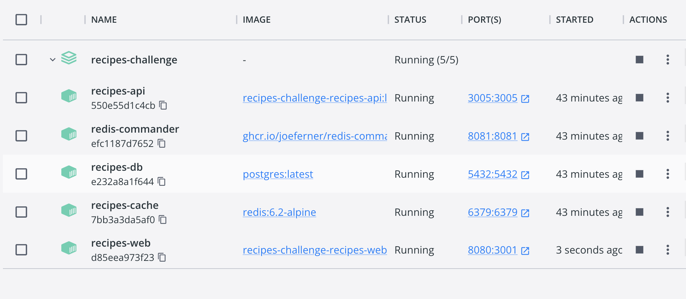

# Recipes Challenge 


This project use:

[NestJs](https://github.com/nestjs/nest) - Backend: NestJS is a framework for building efficient, scalable Node.js web applications. It uses modern JavaScript

[NextJs v13](https://nextjs.org/blog/next-13) - Frontend: This project use NextJs13 bootstrapped with [`create-next-app`](https://github.com/vercel/next.js/tree/canary/packages/create-next-app).

This project use experimental `app` directory of Next13

[PostgreSQL](https://www.postgresql.org) - PostgreSQL is a powerful, open source object-relational database system with over 35 years of active development that has earned it a strong reputation

[TypeORM](https://typeorm.io/) - TypeORM is an ORM that can run in NodeJS

[Node.js](https://nodejs.org/en/) - Node.js® is a JavaScript runtime built on Chrome's V8 JavaScript engine.

[Docker](https://docker.com) - Docker is a platform designed to help developers build, share, and run modern applications. We handle the tedious setup, so you can focus on the code.

[Redis](https://redis.io/) - Redis is an open source (BSD licensed), in-memory data structure store, used as a database, cache, and message broker.

[TheMealDB](https://www.themealdb.com/) - This is a public database of recipes, I take this recipes and fill out my local database. Including images and thumbnails

[MUI](https://mui.com/) - MUI offers a comprehensive suite of UI tools to help you ship new features faster. Start with Material UI, our fully-loaded component library, or bring your own design system to our production-ready components.

# Installation

To run the project you need to install [docker](https://docs.docker.com), and [git](https://git-scm.com/book/en/v2/Getting-Started-Installing-Git) you can follow the instructions below

- [How to install on mac](https://docs.docker.com/desktop/install/mac-install/)
- [How to install on windows](https://docs.docker.com/desktop/install/windows-install/)
- [How to install on linux](https://docs.docker.com/desktop/install/linux-install/)
- [How to install git](https://git-scm.com/book/en/v2/Getting-Started-Installing-Git)

Once you have docker installed, and running in your local environment, you can clone this repository and start the docker containers

```bash
$ git clone https://github.com/ecasanova/recipes-challenge.git
$ cd recipes-challenge
$ docker compose up -d
```

Run this to load the database

```bash
$ cd backend
$ npm run loadrecipes
```

- If migrations don't work, sql file `data-backup.sql` is provided

# Usage

You can see the backend in: [http://127.0.0.1:3005/api](http://127.0.0.1:3005/api)

You can see the frontend in: [http://127.0.0.1:8080](http://127.0.0.1:8080)

You can see redis commander in [http://127.0.0.1:8081/](http://127.0.0.1:8081/)

PostgreSQL database is running on the port 5432

Redis instance is running on the port 6379

# Support

Enrique Casanova - [ecasanova@webfactorystudio.co](ecasanova@webfactorystudio.co)

# Overview

A public database was used for the initial loading of the system, this information was loaded into the PostgreSQL database, and the project includes migrations at startup

# Database Structure

This is the structure of the database:


# Screenshoots

## Frontend



It is possible to initialize the repository locally (The api service is required, it must be turned on)

```bash
$ cd frontend
$ npm run build && npm run start
```

## Backend (API)



It is possible to initialize the repository locally (The database and the cache service are required, they must be activated)

```bash
$ cd backend
$ npm run start
```

## Docker Containers



It is possible to start each container separately.

```bash
docker compose up recipes-api -d #recipes-api (NestJs)
docker compose up recipes-web -d #recipes-web (NextJs)
docker compose up recipes-db -d #recipes-db (PostgreSQL)
docker compose up recipes-cache -d #recipes-cache (Redis)
docker compose up redis-commander -d #redis-commander
```

# Deployed in Vercel

See this project live on [https://recipes-challenge.vercel.app](https://recipes-challenge.vercel.app)

